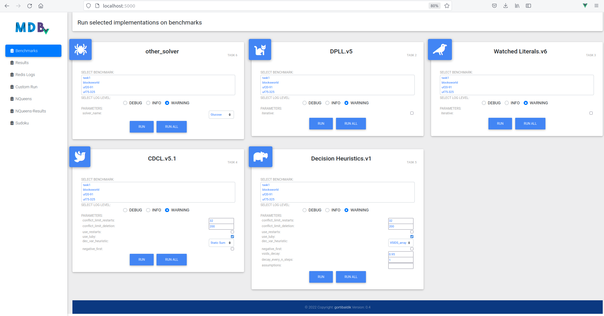
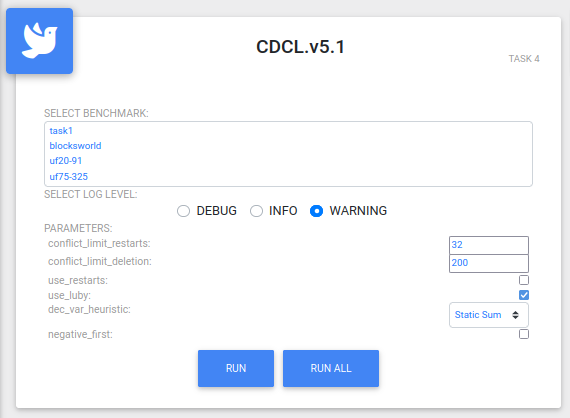
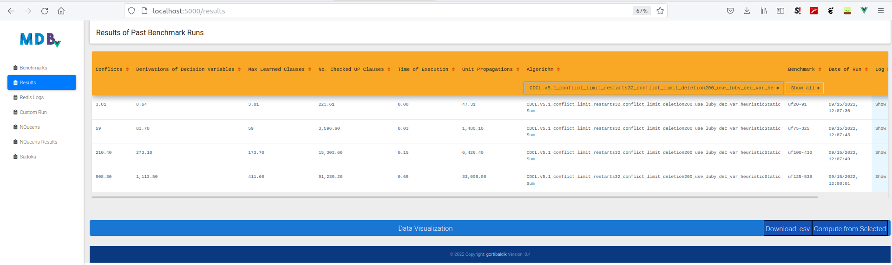
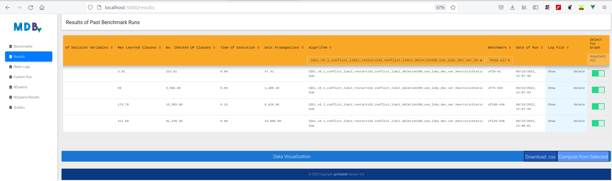
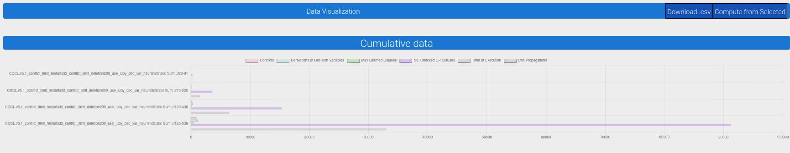
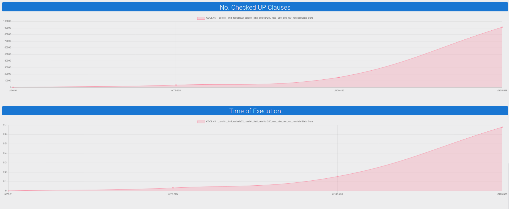
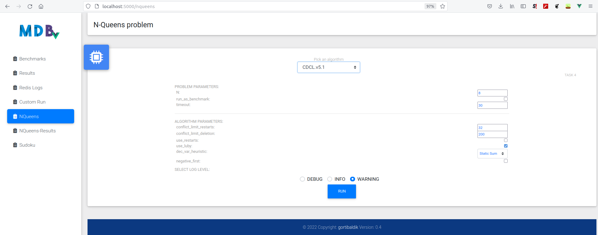
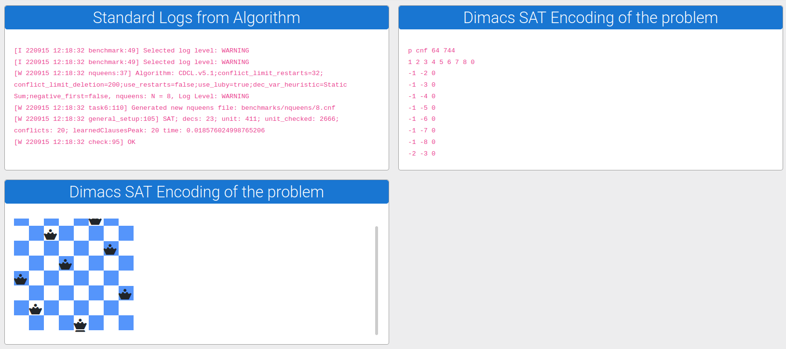
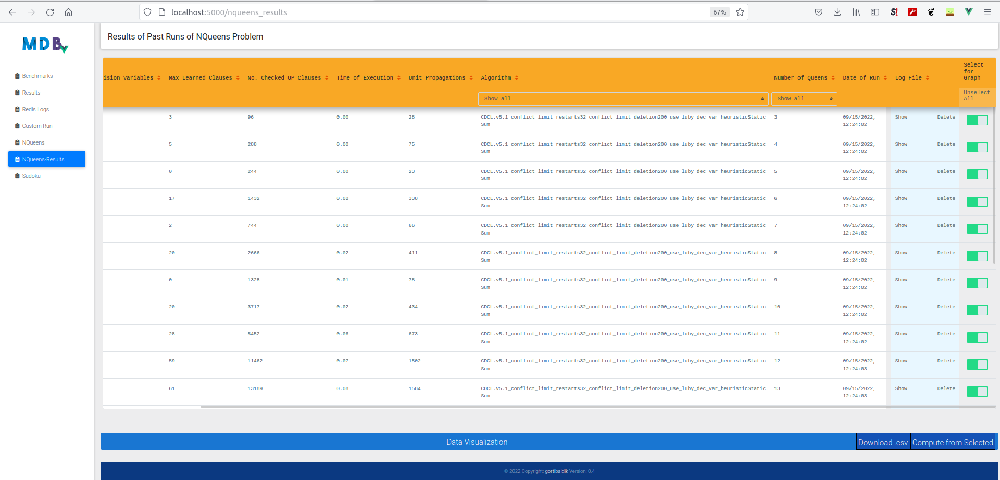
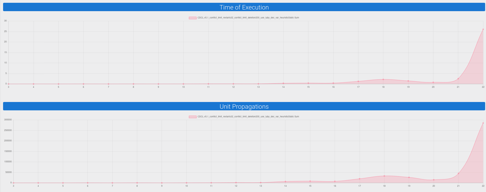

# Frontend User Manual

## Main Screen

- here you can choose an algorithm and a benchmark on which the algorithm will be ran
- a set of statistics will be collected to enable comparison of the algorithm
- each algorithm is in its own card
- you can select:
  - the benchmark
  - log level for the log information that the algorithm will produce on the benchmark
  - parameters which affect the properties of the algorithm

-----

## Results Screen

- allows for browsing the already ran benchmarks as well as data visualizations

#### Select Benchmarks for Visualizations

#### Show Cumulative Visualization

#### Show Individual Statistics

-----
## N-Queens Problem Screen

- select problem parameters (e.g. number of queens)

#### Show Results

- shows:
  - DIMACS encoding of the problem
  - logs of the algorithm
  - visualization of the placement of queens on the chessboard

#### Benchmark Run

- if you check the checkbox `run_as_benchmark` then the algorithm will be ran successively for N=3,4,... until the time of the run won't cross the `timeout` parameter
- after the run, you can browse to `NQueens-Results` page, where the benchmark can be visualized in the same way as in the `Results` page

