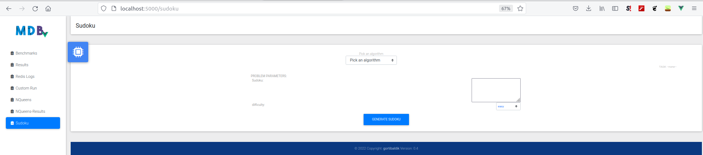
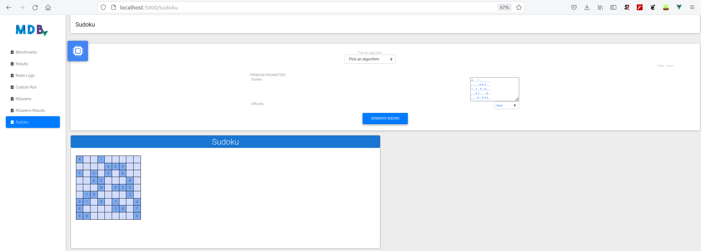
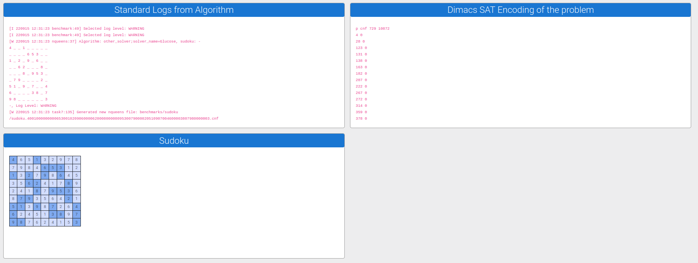

# Frontend User Manual

## Main Screen

- here you can choose an algorithm and a benchmark on which the algorithm will be ran
- a set of statistics will be collected to enable comparison of the algorithm
- each algorithm is in its own card
- you can select:
  - the benchmark
  - log level for the log information that the algorithm will produce on the benchmark
  - parameters which affect the properties of the algorithm

-----

## Results Screen

- allows for browsing the already ran benchmarks as well as data visualizations

#### Select Benchmarks for Visualizations

#### Show Cumulative Visualization

#### Show Individual Statistics

-----
## N-Queens Problem Screen

- select:
  - problem parameters (e.g. number of queens)
  - algorithm parameters

#### Show Results

- shows:
  - DIMACS encoding of the problem
  - logs of the algorithm
  - visualization of the placement of queens on the chessboard

#### Benchmark Run

- if you check the checkbox `run_as_benchmark` then the algorithm will be ran successively for N=3,4,... until the time of the run won't cross the `timeout` parameter
- after the run, you can browse to `NQueens-Results` page, where the benchmark can be visualized in the same way as in the `Results` page

#### Visualization

------

## Sudoku Screen

- the sudoku screen allows:
  - typing out the sudoku in the following format:
    - columns are separated by a space
    - rows are separated by a newline
    - blank symbol: `_`
    - only numbers are supported
  - generating the sudoku:
    - by pressing `Generate Sudoku` button
    - selection of the difficulty of the sudoku by selecting from `difficulty` dropdown

#### Generated Sudoku

- the generated sudoku is displayed
- light bleu is used for cells with blanks

#### Sudoku Results

- shows:
  - DIMACS encoding of the problem
  - logs of the algorithm
  - filled sudoku, with filled numbers in light bleu cells

